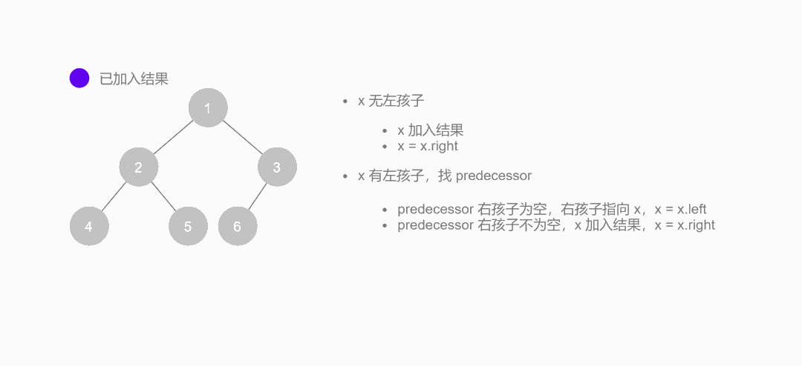

# 二叉树的中序遍历

> 难度：简单
>
> https://leetcode-cn.com/problems/binary-tree-inorder-traversal/

## 题目

给定一个二叉树的根节点 `root` ，返回它的 **中序** 遍历。

### 示例

#### 示例 1:


```
输入：root = [1,null,2,3]
输出：[1,3,2]
```

#### 示例 2:

```
输入：root = []
输出：[]
```

#### 示例 3:

```
输入：root = [1]
输出：[1]
```

#### 示例 1:


```
输入：root = [1,2]
输出：[2,1]
```

#### 示例 5:


```
输入：root = [1,null,2]
输出：[1,2]
```

## 解法

**Morris 遍历算法**是另一种遍历二叉树的方法，它能将非递归的中序遍历空间复杂度降为 `O(1)`。

**Morris 遍历算法**整体步骤如下（假设当前遍历到的节点为 `x`）：

1. 如果 `x` 无左孩子，先将 `x` 的值加入答案数组，再访问 `x` 的右孩子，即 `x =  x.right`
2. 如果 `x` 有左孩子，则找到 `x` 左子树上最右的节点（**即左子树中序遍历的最后一个节点，`x` 在中序遍历中的前驱节点**），我们记为 `predecessor`。根据 `predecessor` 的右孩子是否为空，进行如下操作:
   1. 如果 `predecessor` 的右孩子为空，则将其右孩子指向 `x`，然后访问 `x` 的左孩子，即 `x = x.left`
   2. 如果 `predecessor` 的右孩子不为空，则此时其右孩子指向 `x`，说明我们已经遍历完 `x` 的左子树，我们将 `predecessor` 的右孩子置空，将 `x` 的值加入答案数组，然后访问 `x` 的右孩子，即 `x = x.right`
3. 重复上述操作，直至访问完整棵树



其实整个过程我们就多做一步：假设当前遍历到的节点为 `x`，将 `x` 的左子树中最右边的节点的右孩子指向 `x`，这样在左子树遍历完成后我们通过这个指向走回了 `x`，且能通过这个指向知晓我们已经遍历完成了左子树，而不用再通过栈来维护，省去了栈的空间复杂度。


```typescript
/**
 * Morris 中序遍历
 * @desc 时间复杂度 O(N)  空间复杂度 O(1)
 * @param root {TreeNode | null}
 * @return {number[]}
 */
export function inorderTraversal3(root: TreeNode | null): number[] {
  const res: number[] = [];
  let predecessor: TreeNode | null = null;

  while (root) {
    if (root.left) {
      // predecessor 节点就是当前 root 节点向左走一步，然后一直向右走至无法走为止
      predecessor = root.left;
      while (predecessor.right && predecessor.right !== root) {
        predecessor = predecessor.right;
      }

      // 让 predecessor 的右指针指向 root，继续遍历左子树
      if (predecessor.right === null) {
        predecessor.right = root;
        root = root.left;
      }
      // 说明左子树已经访问完了，我们需要断开链接
      else {
        res.push(root.val);
        predecessor.right = null;
        root = root.right;
      }
    }
    // 如果没有左孩子，则直接访问右孩子
    else {
      res.push(root.val);
      root = root.right;
    }
  }

  return res;
}
```